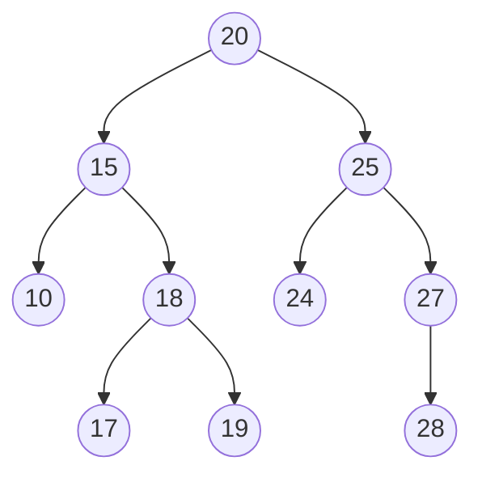
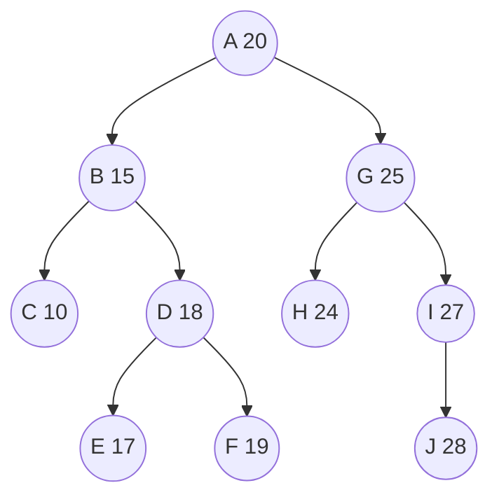
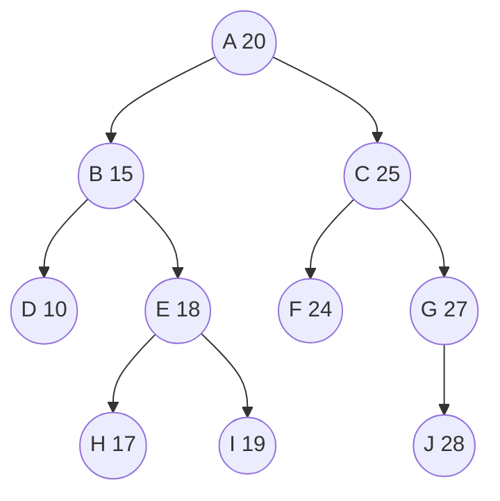
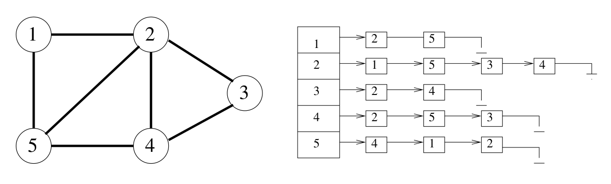

# Algorithms

This repsitory contains the following algorithms along with tests using `SOME_TEST_LIBRARY`:

 - A Linked List
 - A Binary Tree
 - A Graph using an Adjacency List
 - Depth First Search using recursion
 - Breadth First Search using a while loop

## Setup

    conda create -p ./.conda python=3.10 -y
    conda activate ./.conda
    pip install -r requirements.txt

## DFS and BFS

When inserting the following keys into the graph in this order it will create the following graph structure in a binary tree.

Keys: [20, 15, 18, 10, 25, 24, 27, 19, 17, 28]

### Print keys using DFS
Keys: [20, 15, 10, 18, 17, 19, 25, 24, 27, 28]

### Print keys using BFS
Keys: [20, 15, 25, 10, 18, 24, 27, 17, 19, 28]

## Adjacency List

